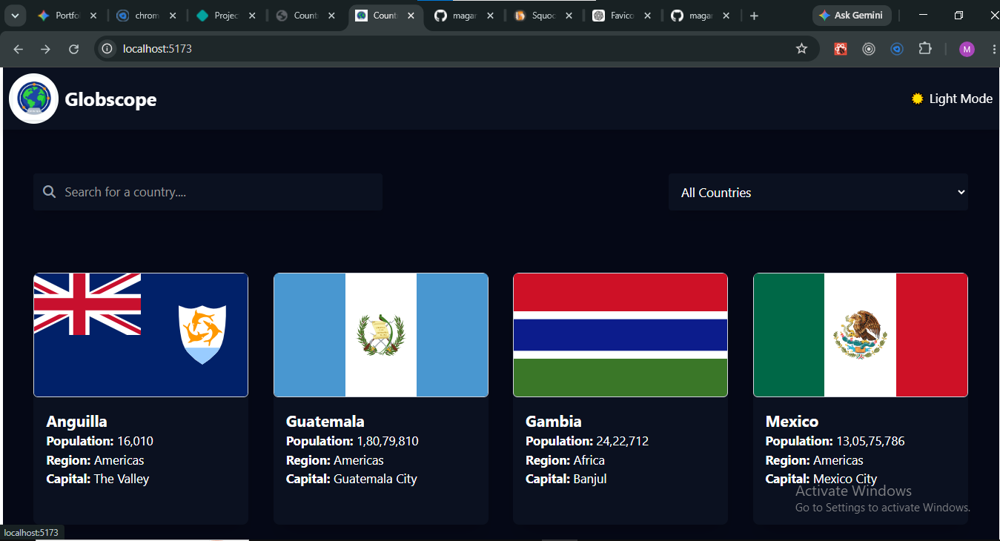
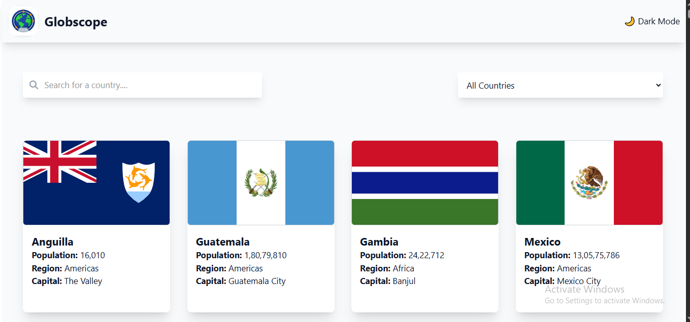
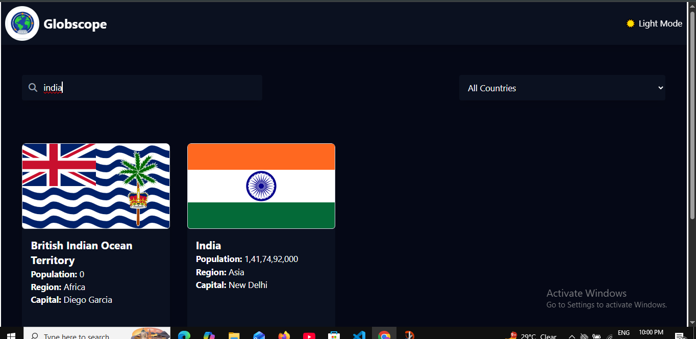
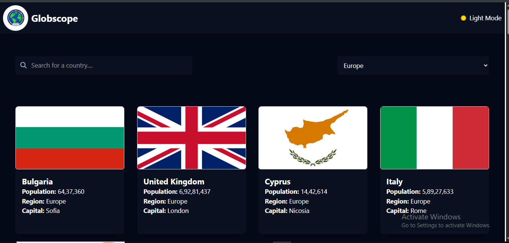
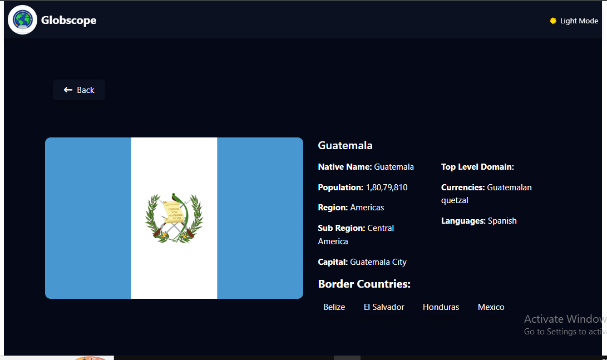
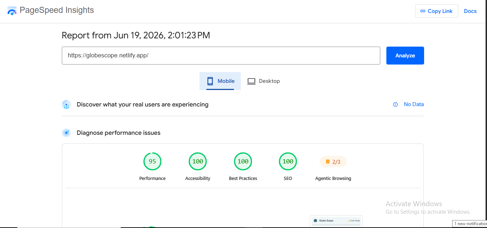
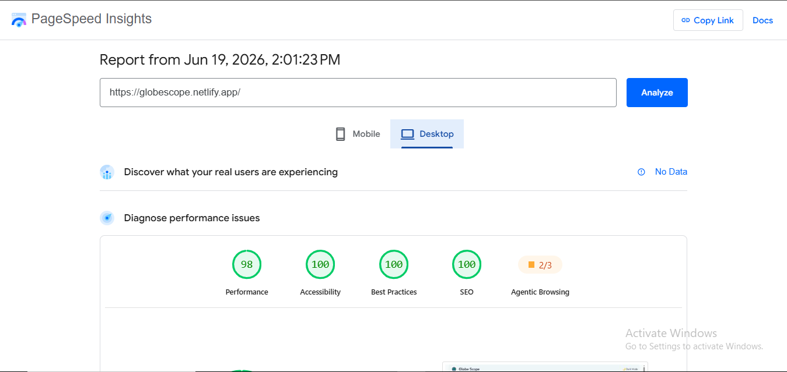
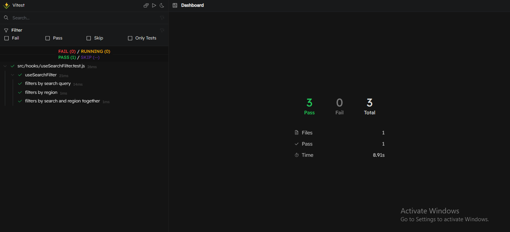
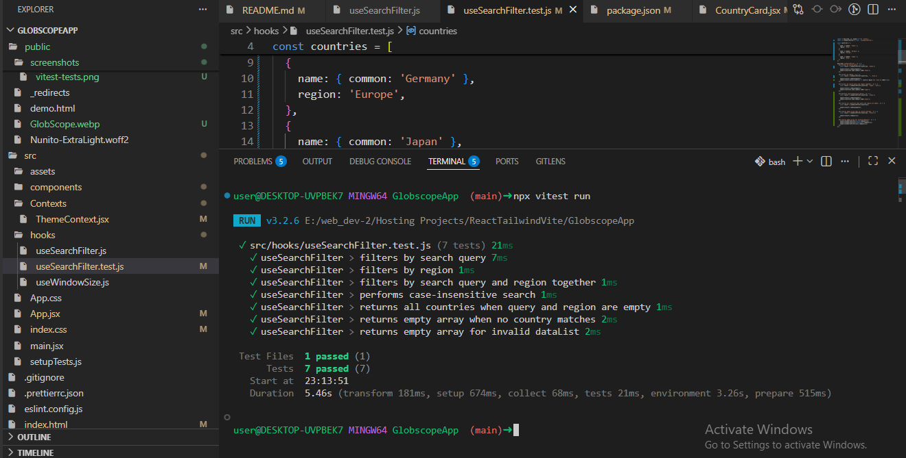

<p align="center">
  

  
  
  
  
</p>

# GlobeScope (REST Countries Explorer)

A modern REST Countries Explorer built with React 19, Vite 7, and Tailwind CSS v4. GlobeScope allows users to search, filter, and explore detailed country information through a responsive and accessible interface. The project focuses on performance optimization, code splitting, reusable architecture, automated testing, and modern frontend development best practices.

<p align="center">
  
  
  
  
</p>

---

## ✨ Features

- Real-time country search with instant filtering
- Region-based filtering system
- Detailed country information with dynamic routing
- Border country navigation for seamless exploration
- Dark / Light theme with persistent state
- Fully responsive UI across all devices
- Skeleton loaders for better perceived performance
- Error boundaries with fallback UI
- SEO optimized pages using dynamic metadata (React Helmet Async)

---

## 🏗️ Architecture

The application is built using a modular, component-driven architecture:

- React Context API for global state management
- React Router v7 for client-side routing
- Custom hooks for reusable logic abstraction
- Lazy loading and code splitting using React.lazy & Suspense
- Tailwind CSS v4 for utility-first styling
- React Helmet Async for dynamic SEO metadata
- Vitest + Testing Library for unit testing

---

## 🎯 Project Goals

This project was built to:

- Explore modern React 19 development practices.
- Build a scalable and reusable component-based architecture.
- Implement client-side routing using React Router v7.
- Practice state management with the React Context API.
- Improve web performance through lazy loading and code splitting.
- Enhance accessibility and SEO using semantic HTML and dynamic metadata.
- Gain hands-on experience with automated testing using Vitest.
- Create a fully responsive user experience across mobile, tablet, and desktop devices.

---

## 🔗 Important Links

🌐 Live Website: https://globescope.netlify.app/
💻 Repository: https://github.com/theprocoderx/globescope
👨‍💻 Portfolio: https://procoderx.com
🐙 GitHub: https://github.com/theprocoderx
💼 LinkedIn: https://linkedin.com/in/procoderx
📧 Email: procoderxs@gmail.com

---

## 📸 Application Screenshots

### Home Dashboard (Light & Dark Environments)




### Advanced Navigation & Search Operations




### Deep Country Analytics View



## ⚡ Performance Audit (Google PageSpeed Insights)

#### Mobile Performance



#### Desktop Performance

## 

---

### 📄 Full Performance Report

- 📥 [Download PageSpeed Insights Report](./public/reports/lighthouse-report.pdf)

---

## 🚀 Performance Optimizations

- Route-based code splitting
- Lazy loading using React.lazy and Suspense
- Optimized font loading
- Lighthouse performance improvements
- Skeleton loading states
- Reduced unnecessary re-renders
- Context-based state sharing
- Efficient search and filtering logic

---

## 🧪 Testing

The project includes automated unit testing using Vitest and Testing Library.

### Tested Areas

- Country search functionality
- Region filtering logic
- Custom hook behavior
- Edge case validation

Run tests locally:

```bash
npm run test
npm run test -- --coverage
```

<p align="center">
  
  
</p>

---

## 📚 Challenges & Learnings

During development, I gained hands-on experience with:

- Implementing route-based code splitting
- Managing global state with Context API
- Writing unit tests using Vitest
- Improving Lighthouse performance metrics
- Creating reusable custom hooks
- Implementing responsive layouts with Tailwind CSS
- Handling dynamic metadata using React Helmet Async
- Optimizing user experience with loading skeletons

---

## 🧰 Technical Stack

### ⚙️ Core Technologies

- 
- 
- 
- 

### 🎨 UI & Assets

- 
- 

### 🚀 Developer Tools & Quality

- 
- 
- 

---

## 💡 Skills Demonstrated

- Building scalable React applications with component-driven architecture
- Managing global state using Context API
- Implementing client-side routing with React Router v7
- Designing reusable custom hooks for logic abstraction
- Optimizing performance using lazy loading & code splitting
- Developing fully responsive, mobile-first user interfaces
- Implementing accessibility best practices (WCAG principles)
- Enhancing SEO using dynamic metadata (React Helmet Async)
- Writing unit tests with Vitest & Testing Library
- Structuring clean, maintainable, and reusable codebase
- Using Git & GitHub for version control and workflow management

---

## 📁 Project Structure

```bash
GlobeScope/
│
├── public/
│   ├── fonts/
│   └── screenshots/
│
├── src/
│   ├── assets/
│   │
│   ├── components/
│   │   ├── CountriesListShimmer.jsx
│   │   ├── CountryCard.jsx
│   │   ├── CountryDetail.jsx
│   │   ├── CountryDetailShimmer.jsx
│   │   ├── Error.jsx
│   │   ├── Footer.jsx
│   │   ├── Header.jsx
│   │   ├── Home.jsx
│   │   ├── ScrollToTop.jsx
│   │   └── SearchFilterControls.jsx
│   │
│   ├── Contexts/
│   │   ├── CountriesContext.jsx
│   │   └── ThemeContext.jsx
│   │
│   ├── data/
│   │   └── countries-v3.json
│   │
│   ├── hooks/
│   │   └── useWindowSize.js
│   │
│   ├── SearchFilterControls.test.jsx
│   ├── App.jsx
│   ├── App.css
│   ├── index.css
│   ├── main.jsx
│   └── setupTests.js
│
├── eslint.config.js
├── index.html
├── package.json
├── package-lock.json
└── vite.config.js
```

---

## ⚙️ Installation & Setup

Clone the repository:

```bash
git clone https://github.com/maganstackforge/GlobeScope.git
```

Navigate to the project directory:

```bash
cd GlobeScope
```

Install dependencies:

```bash
npm install
```

Start the development server:

```bash
npm run dev
```

---

👉 Ye technically wrong Markdown hai (table ko bash block me mat rakho)

---

## 🛠️ Available Scripts

| Command               | Description                           |
| --------------------- | ------------------------------------- |
| npm run dev           | Starts the development server         |
| npm run build         | Creates an optimized production build |
| npm run preview       | Previews production build locally     |
| npm run test          | Runs Vitest test suites               |
| npm run test:coverage | Generates test coverage report        |
| npm run test:ui       | Opens Vitest UI                       |
| npm run lint          | Checks ESLint issues                  |
| npm run lint:fix      | Fixes ESLint issues automatically     |
| npm run format:fix    | Formats code using Prettier           |
| npm run clean         | Runs lint fix + format + check        |

---

## 👨‍💻 Author

**Magan Singh**  
Frontend Developer passionate about building modern, responsive, and high-performance web applications using React and JavaScript.

- 🎓 MCA Graduate
- ⚛️ React & JavaScript Enthusiast
- 🎯 Focused on Frontend Development and UI/UX Design

### 💼 Experience

**Frontend Developer (Intern)**  
Namrata Universal — Nov 2025 – Present

- Working on frontend development tasks using HTML, CSS, JavaScript, and React
- Building responsive UI components and improving user experience
- Collaborating on real-world projects

## 📄 Disclaimer

This project is created for educational and portfolio purposes only. It is not intended for commercial use.

## 📌 Note

This project is actively maintained and built as part of continuous learning in modern frontend development.
